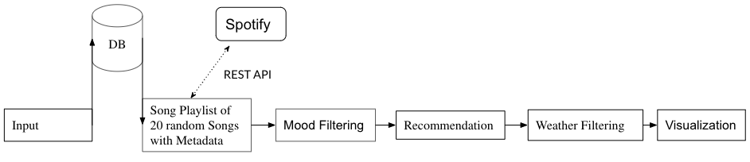

# Music Recommender System
TEAM The United Nations for KAIST CS470 project

## How do we recommend music?


We have already trained our models with different songs from Spotify. A user needs to provide us a playlist with at least one song. We will analyse the song based on the metadata we have from Spotify (either from our PostgreSQL database or via Spotify REST API). After that we will perform some clustering and classification in order to pick the best songs that would additionall fit to the given playlist. Thoose songs are then filtered out by the current weather condition of users location e.g. sad music when it is rainy and the result is visualized in a table format.

Have a look at more detailed explanation in our [Project's Presentation](./docs/Project%20Presentation.pdf).

## Important Notice

Since the old repository is moved to the new one (this), some paths in the code may not work as expected. Furthermore, additional testing and code execution will be made to ensure that filling of database, training of models and recommendations itself work as they used to do. Sorry for the inconvenience.

In the future it is planned to run the Python recommenders (not the Jupyter Notebook) via a bash script that will setup and env and install dependencies in advance.

## Setup
You need to install poetry first. Please refer to [poetry documentation](https://python-poetry.org/docs/#installation). 
After that you can install the dependencies with the following bash command:
```bash
poetry install
```

## Contributors
- [@chlomatic16](https://github.com/chlomatic16)
- [@NishantNepal1](https://github.com/NishantNepal1)
- [@shenllyz](https://github.com/shenllyz)
